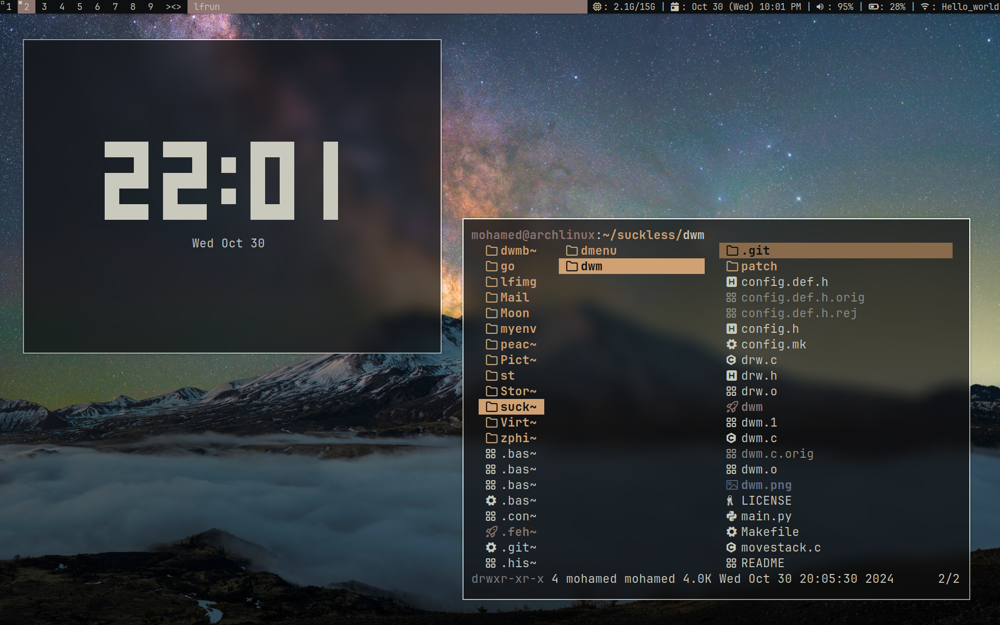
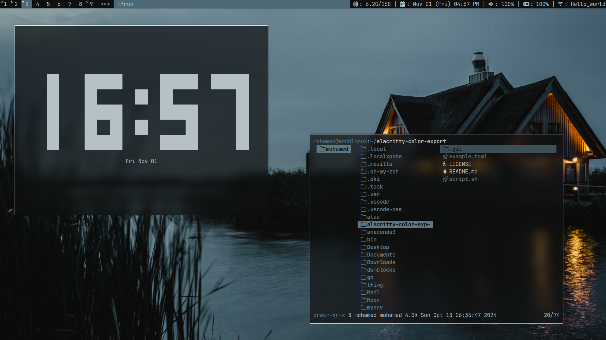
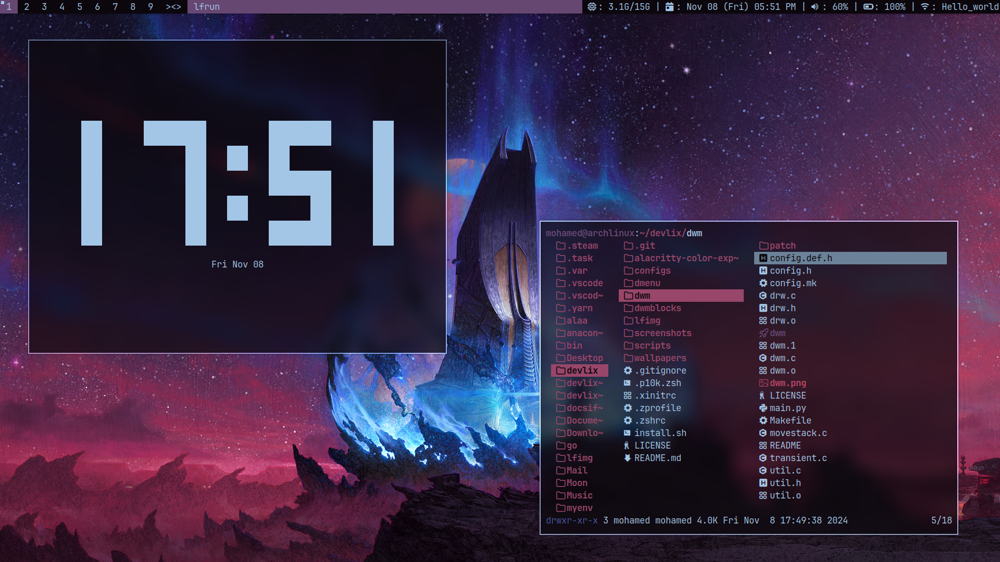

# What is Devlix

> Devlix is a window manager based on `dwm 6.5`, designed to provide a lightweight, efficient, and customizable environment for users who prefer minimalism and simplicity in their computing experience. Built with performance in mind, Devlix focuses on delivering a streamlined user interface that enhances productivity while utilizing minimal system resources. Unlike `dwm`, which often requires extensive configuration and patching, Devlix is ready to use out of the box, allowing users to quickly set up and start working without the need for extensive customization.

## Features

- **Minimalistic Design**: Devlix features a minimalistic design characterized by simple shapes and a focus on enhancing productivity and efficiency, ensuring that users are not overwhelmed by unnecessary complexity.

- **Easy**: Devlix has extensive documentation that covers every aspect of the window manager, along with pre-made scripts that are well-documented and include clear comments, making them easy to use. Additionally, it features several TUI (Text User Interface) tools that further simplify the user experience.

- **Ultra Lightweight**: Devlix is designed to be ultra lightweight, ensuring minimal resource usage while delivering optimal performance. It operates significantly faster than other desktop environments, providing a responsive experience even on systems with limited hardware capabilities. By utilizing `picom` for compositing, Devlix achieves a beautiful visual appearance while maintaining minimal RAM usage, typically around only 500 MB. This makes it an ideal choice for users seeking a fast, efficient, and aesthetically pleasing computing environment.

## Screenshots
| 1 | 2 | 3 |
|---|---|---|
|  |  |  |

## Our Community

(Coming Soon)

## Contributions

(Coming Soon)

## Issues

(Coming Soon)